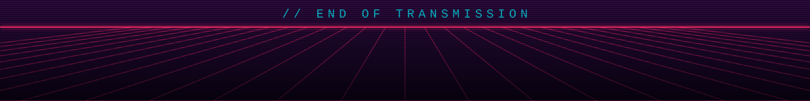

  

 

Full-Stack Developer with **~2 years of commercial experience**, a strong frontend core, and a deep interest in **AI integration, ML, and data workflows**.

I bridge product engineering, clean architecture, and UI/UX — designing systems from database schemas and REST/gRPC contracts to responsive, accessible client interfaces. Graduate in Software Engineering from IITU (МУИТ).

  
  
  
  

 

  

**Frontend** — `React` `Next.js (App Router)` `TypeScript` `JavaScript` `TanStack React Query` `Vue 3` `HTML5` `CSS3` `Tailwind CSS`

**Backend** — `Go (Gin)` `Python` `Java` `REST API` `gRPC` `JWT` `OpenAPI Contracts` `Microservices`

**Databases & Storage** — `PostgreSQL` `Redis` `SQL` `PL/SQL (Oracle)` `GORM` `Schema Design` `Versioned Migrations`

**Architecture & Security** — `SOLID` `Modular Monoliths` `RBAC / Role-based Access` `Integration Design`

**DevOps & Tooling** — `Docker` `Docker Compose` `CI/CD (GitHub Actions)` `Git` `Linux` `Grafana & Metrics`

**AI & Data** — `Python` `Machine Learning fundamentals` `Data processing pipelines` `AI integration & workflow automation`

**Design & Systems** — `Figma` `CorelDRAW` `Design Systems` `UX user flows`

**Networking** — `Cisco Basics` `TCP/IP fundamentals`

 

### Full-Stack Developer · New Med

- Leading feature development and architecture across **3 core digital health products**, covering frontend, backend services, REST APIs, and database engineering.
- Designing strict API contracts, role-based access flows (JWT/RBAC), and transactional PostgreSQL schemas with automated migrations.
- Owning the release lifecycle end-to-end: client-server integration, containerization via Docker, and production delivery via CI/CD pipelines.

### Junior Full-Stack Developer & Designer · Kamiqr

- Built dynamic digital menu platforms and an internal site-builder engine serving active business clients.
- Engineered multi-language systems (KZ / RU / EN), structured CMS schemas, and responsive storefronts.
- Combined UI/UX design in Figma with production frontend code, cutting turnaround time between product spec and deployment.

### DiplomaFlow · Full-Stack Academic Management Platform

- Architected and delivered an enterprise-grade thesis management ecosystem featuring **10+ business modules** (Kanban board, role-driven dashboards, audit trails, and notification pipelines).
- **Backend:** Go (`Gin`), REST API, PostgreSQL, GORM, JWT/RBAC security model.
- **Frontend:** Next.js, TypeScript, TanStack React Query, Tailwind CSS.
- **Infrastructure:** Dockerized local/staging runtime, GitHub Actions automated CI/CD.

 

  

 

  &nbsp;

